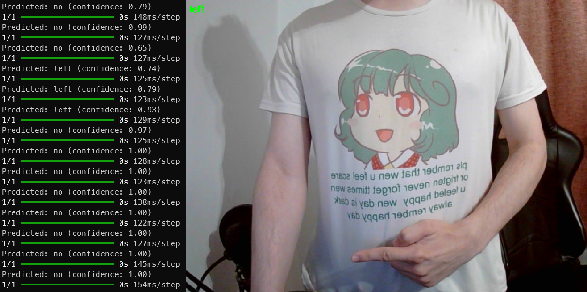

# Powerpoint AI

Zestaw narzędzi do uczenia modelu sztucznej inteligencji wykrywającej gesty prowadzącego prezentację

## Opis

### app.py

Gotowa aplikacja wykrywająca gesty prowadzącego prezentacje. Możliwe stany:

- `no` - nie wykryto gestów
- `right` - wykryto palec wskazujący w prawo, następuje przełączenie do następnego slajdu
- `left` - wykryto palec wskazujący w lewo, następuje przełączenie do poprzedniego slajdu

Do poprawnego działania aplikacja potrzebuje modelu wyeksportowanego z `train.ipynb`

### create_photos.py

Aplikacja wspomagająca tworzenie zdjęć służących jako dane do trenowania modelu. Sterowanie:

- `a` - przygotowanie do wykonywania zdjęć oznaczonych jako `left`
- `s` - przygotowanie do wykonywania zdjęć oznaczonych jako `no`
- `d` - przygotowanie do wykonywania zdjęć oznaczonych jako `right`
- `enter` - wykonanie zdjęcia w miejscu uruchomienia programu

### train.ipynb

Program trenujący model na danych zebranych z `create_photos.py`

## Przygotowanie projektu

1. Wymagany zainstalowany `Python 3.12` lub starszy
2. `python -m venv .venv`
3. `.venv\Scripts\activate`
4. `pip install -r requirements.txt`

## Budowanie

Aplikację do robienia zdjęć buduje się poleceniem `pyinstaller --onefile create_photos.py`

Aplikację główną buduje się poleceniem `pyinstaller --onefile app.py`

Wynikowe pliki `.exe` będą dostępne w folderze `dist`
